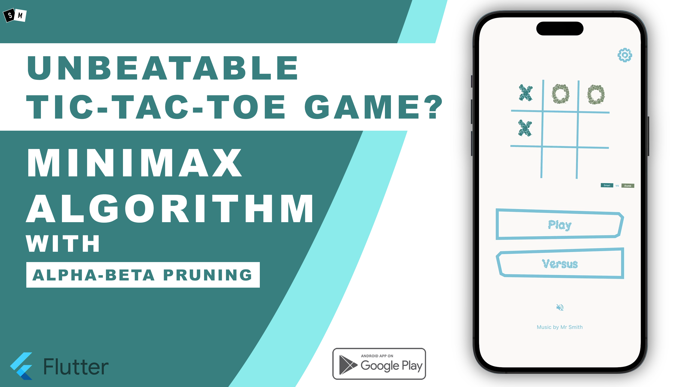

# mxn TicTacToe Game
A TicTacToe Game developed in flutter with 2 game modes, vs-player
and vs-AI, where players can compete with another player
and AI respectively.

► [Test on PlayStore](https://play.google.com/store/apps/details?id=bumble.game.tictactoe)

► [Video Tutorial On Youtube](https://www.youtube.com/watch?v=H98Pvej2SE0)

► [Written Tutorial On Medium](https://cshanjib.medium.com/creating-an-unbeatable-tic-tac-toe-game-using-minimax-algorithm-with-alpha-beta-pruning-in-flutter-f666594be0b4)

## Features :
- m*n TicTacToe Board
- Vs Game Mode
- Vs AI Mode
- 3 levels of AI difficulty
- minimax algorithm with alpha-beta pruning
- AI vs AI simulation
- available in Play Store for testing

## TODO:

- [ ] Make this an online Game
- [ ] New Game mode with new rules
- [ ] Introduce Timers
- [ ] SignUp Feature
- [ ] Professional Score Board
- [ ] More to come

For vs AI mode, it has 3 levels of difficulty. The initial levels are easier with AI choosing moves randomly. 
The intermediate levels are a bit logical but are still beatable. 
For the final levels, we'll use the Minimax algorithm plus alpha-beta pruning for optimization. 
Finally, we'll complete the game by doing the AI vs AI simulation where 2 of the available 3 AIs are chosen randomly(inclusive) and the match is played between them.

# Feedback and Support
If you have any queries or feedback, please do reach me out in cshanjib@gmail.com and don't forget to leave a star ⭐️ to show your support. Feel free to fork this repository and make changes as per your need.